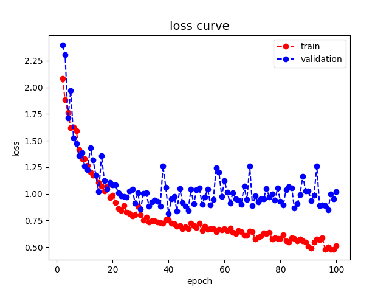
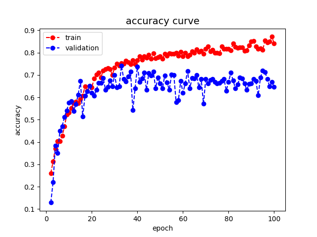

# HW1: Classification

## Environment

* Python: 3.9.13
* Pytorch: 2.0.1
* Torchvision: 0.13.1 (only used for data augmentation)
* Pandas: 1.5.0
* Numpy: 1.23.3
* Matplotlib: 3.6.0
* Pillow: 9.2.0
* Tqdm: 4.64.1
* Typed-argument-parser: 1.7.2

## How to reproduce?

### Training

```sh
python train.py --lr 0.001 --weight_decay 0 --batch_size 16 --epoch_size 100 --num_workers 4
```

### Testing

```sh
python test.py --model HW1_311553007.pth --batch_size 32 --num_workers 4
```

## Hyper-parameters

* Loss function: Cross-Entropy with softmax
* Optimizer: Adam
* Learning rate: 0.001
* Momentum: 0.9
* Weight decay: 0.02
* Batch size: 32
* Seed: 1234

## Model

> Number of parameters: 5.12M (5,121,309)
>
> In network class,
> 
>
> The bias of all layers is false.

### Components

#### Dense Layer

| Layers           | Output Size (example) | Note                            |
| :--------------- | :-------------------- | :------------------------------ |
| BatchNorm + ReLU | 64 x 56 x 56          |                                 |
| Conv             | 128 x 56 x 56         | 1 x 1 conv, stride 1            |
| BatchNorm + ReLU | 128 x 56 x 56         |                                 |
| Conv_dw*         | 32 x 56 x 56          | 3 x 3 conv, stride 1, padding 1 |
| Dropout          | 32 x 56 x 56          | p=0.5                           |

#### Transition Layer

| Layers           | Output Size (example) | Note                                   |
| :--------------- | :-------------------- | :------------------------------------- |
| BatchNorm + ReLU | 256 x 56 x 56         |                                        |
| Conv             | 128 x 56 x 56         | 1 x 1 conv, stride 1                   |
| MaxPooling       | 128 x 28 x 28         | 3 x 3 max pooling, stride 2, padding 1 |

### VGG19-like network

> VGG19 + DenseNet + Depth-wise Separable Convolution

| Layers                | Output Size    | Note                                   |
| :-------------------- | :------------- | :------------------------------------- |
| Conv_dw*              | 64 x 112 x 112 | 7 x 7 conv, stride 2, padding 3        |
| BatchNorm + ReLU      | 64 x 112 x 112 |                                        |
| MaxPooling            | 64 x 56 x 56   | 3 x 3 max pooling, stride 2, padding 1 |
| DenseBlock (64)       | 256 x 56 x 56  | Dense Layer x 6                        |
| TransitionLayer (64)  | 128 x 28 x 28  |                                        |
| DenseBlock (128)      | 512 x 28 x 28  | Dense Layer x 12                       |
| TransitionLayer (128) | 256 x 14 x 14  |                                        |
| DenseBlock (256)      | 1024 x 14 x 14 | Dense Layer x 24                       |
| TransitionLayer (256) | 512 x 7 x 7    |                                        |
| DenseBlock (512)      | 2048 x 7 x 7   | Dense Layer x 16                       |
| BatchNorm + ReLU      | 1024 x 7 x 7   |                                        |
| MaxPooling            | 1024 x 1 x 1   | global max pooling                     |
| Linear                | 10             | classifier                             |

***dw**: depth-wise separable convolution

If you want to check the details, you can check this image, [detailed model structure](#Detailed-model-structure).

## Result

### Loss curve



### Accuracy curve



## Discussion

### 

## References

### Detailed model structure

<div style="text-align: center;">
    
</div>
