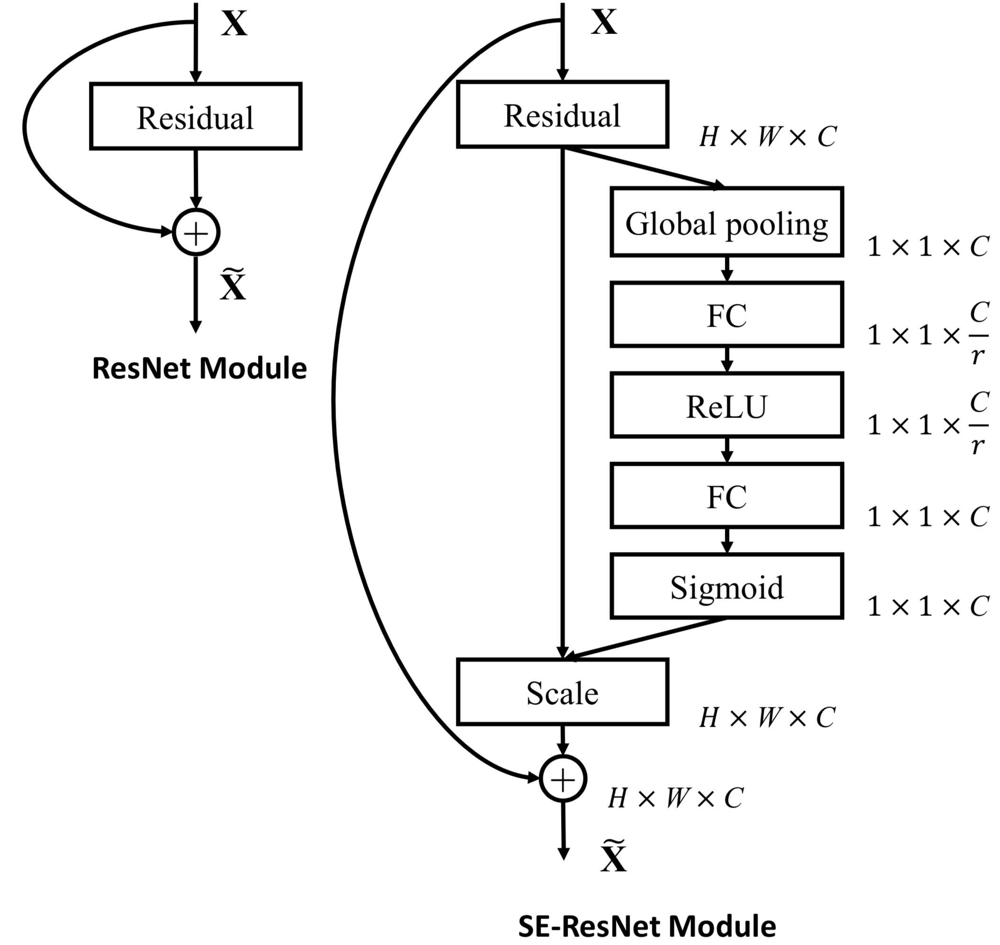
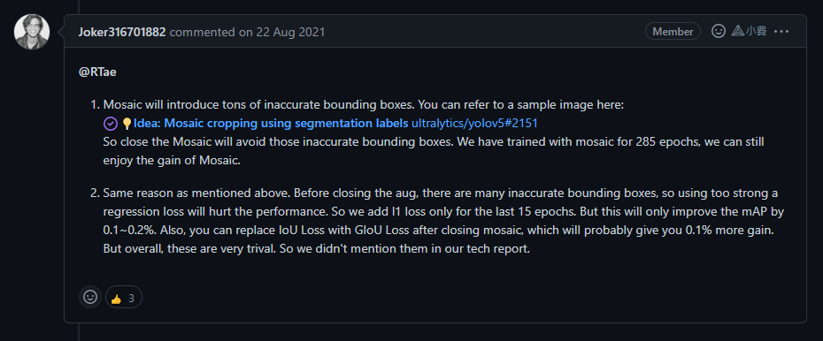
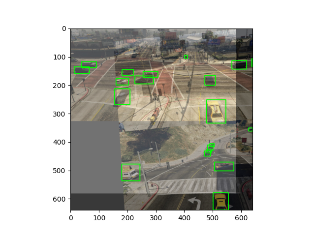

# HW2: Object Detection

[TOC]

## TODO

* [x] Implement dataset
* [x] Implement evaluator
* [x] Implement Exp
* [x] Add SE module
* [x] Optimize trainer.py (Optional)
* [x] Optimize metrics visualization (Optional)
* [x] Produce val/test results via demo.py

## Introduction

本專案為了易用、評估模型的訓練狀況，做了以下更動

1. *將 [Object-Detection-Metrics](https://github.com/rafaelpadilla/Object-Detection-Metrics) 程式嵌入至自行撰寫的 evaluator (voc2012_evaluator.py)

2. 自行撰寫 dataset (gta_video.py)，無須事先轉換 dataset 即可直接執行
3. 改善 trainer.py 中的 tensorboard logging 方式，支援 logging training loss 與 evaluator 自訂義回傳的 metrics
4. 將 training data 加入至 evaluator，以便在 tensorboard 上查看是否有 overfitting 的情況
5. 更改 demo.py，輸出 prediction results

*雖然嵌入至 evaluator 中，但 validation results 部分還是會丟至原本指定的程式中執行，以示公平

## Environment

* Anaconda: 4.13.0
* CUDA: 11.3
* Python: 3.9.13
* Pytorch: 1.12.1
* Torchvision: 0.13.1 (only used for data augmentation)
* Pandas: 1.5.1
* Numpy: 1.23.4
* Matplotlib: 3.6.1
* Opencv-python: 4.6.0.66
* 其他 YOLOX source code 用到的套件 (requirements.txt)

## Experiment Setup
### Data preprocessing
使用 YOLOX source code 寫好的 data augmentation classes (data_augment.py & mosaic.py)，更改超參數

* Mosaic
* Mix Up
* Affine Transformations (translation, rotation, scaling, shearing)
* Horizontal Flip
* HSV color jitter

#### YOLOX (original)

使用自行撰寫的 Dataset class 自動將 label 格式轉為 xyrb，不必事先轉換，即可 training/inference

#### YOLOX + SE module

使用自行撰寫的 Dataset class 自動將 label 格式轉為 xyrb，不必事先轉換，即可 training/inference

### Hyperparameters
其餘未提及的部分皆為 Exp class(yolox_base.py) 的預設值

* Model: yolox_s (depth: 0.33, width: 0.5)
* Max epoch: 200
* No augment epochs: 20
* Max labels: 50
* Seed: 1234

#### YOLOX (original)

* Activation function: SiLU
* Loss function: IoU
* Depthwise: False

#### YOLOX + SE module
* Activation function: SiLU
* Loss function: IoU
* Depthwise: False

### Model architecture

#### YOLOX (original)

依照 [Paper](https://arxiv.org/abs/2107.08430) 架構，無多做更改，詳細架構請見最後 [Appendix A](#A)

下圖取自於 https://blog.csdn.net/nan355655600/article/details/119666304


下圖取自於 paper


#### YOLOX + SE module

將 SE module 嵌入至 Bottleneck，Bottleneck 位於 CSPLayer 中，在 backbone(CSPDarknet53) 與 FPN(PANet) 皆有用到，詳細架構請見最後 [Appendix B](#B)

* SE module in Bottleneck，其中 FC layer 為 Conv2d 1x1

  ```python
  Bottleneck(
      (conv1): BaseConv(
          (conv): Conv2d(32, 32, kernel_size=(1, 1), stride=(1, 1), bias=False)
          (bn): BatchNorm2d(32, eps=0.001, momentum=0.03, affine=True, track_running_stats=True)
          (act): SiLU(inplace=True)
      )
      (conv2): BaseConv(
          (conv): Conv2d(32, 32, kernel_size=(3, 3), stride=(1, 1), padding=(1, 1), bias=False)
          (bn): BatchNorm2d(32, eps=0.001, momentum=0.03, affine=True, track_running_stats=True)
          (act): SiLU(inplace=True)
      )
      (se_m): SELayer(
          (avg_pool): AdaptiveAvgPool2d(output_size=1)
          (fcn): Sequential(
              (0): Conv2d(32, 2, kernel_size=(1, 1), stride=(1, 1))
              (1): ReLU(inplace=True)
              (2): Conv2d(2, 32, kernel_size=(1, 1), stride=(1, 1))
              (3): Sigmoid()
          )
      )
  )
  ```

  

  下圖取自於: https://raw.githubusercontent.com/hujie-frank/SENet/master/figures/SE-ResNet-module.jpg

  

## Brief explain your code
> 使用 [YOLOX official code](https://github.com/Megvii-BaseDetection/YOLOX) 進行訓練

由於訓練時間占大部分時間，來不及實驗加入其他 module，因此只加入 SE module

### SE module

從 SENet 的 [source code](https://github.com/hujie-frank/SENet/blob/master/models/SENet-154.prototxt#L254) 中得知，是使用 Conv2d 1x1，而不是 Linear layer，因此在此使用 Conv2d 1x1

下面為 SE module 實作

```python
class SELayer(nn.Module):
    def __init__(self, in_channels: int, reduction: int = 16) -> None:
        super().__init__()
        inner_channel = in_channels // reduction
        self.avg_pool = nn.AdaptiveAvgPool2d(1)
        self.fcn = nn.Sequential(
            nn.Conv2d(in_channels, inner_channel, kernel_size=1),
            nn.ReLU(inplace=True),
            nn.Conv2d(inner_channel, in_channels, kernel_size=1),
            nn.Sigmoid(),
        )

    def forward(self, x: torch.Tensor) -> torch.Tensor:
        y = self.avg_pool(x)
        y = self.fcn(y)
        return x * y
```

### How to setup?

> 請按照以下順序，依序 setup
#### Installation

```bash
conda create -n yolox python=3.9.13
conda activate yolox

cd Code/Original
# or cd Code/SE

# 兩種安裝套件方式
# 1. environment.yml
conda env create -f environment.yml
# 注意: 如果在 Original/SE 間切換，須再執行一次下面指令
pip install -v -e .

# 2. Manually
# cudatoolkit 版本請自行更改成目前安裝的 cuda 版本，支援 CUDA 10.2, CUDA 11.3, CUDA 11.6
conda install pytorch==1.12.1 torchvision==0.13.1 cudatoolkit=11.3 -c pytorch
# 注意: 如果在 Original/SE 間切換，須再執行一次下面指令
pip install -v -e .
```

#### Place the GTA dataset

1. 建立資料夾，名稱為 `GTA`
2. 解壓縮 dataset 至 `GTA ` 資料夾
3. 將 GTA 資料夾移至 `Code/Original/datasets` 與 `Code/SE/datasets` 資料夾裡

#### Place the pretrained/trained weights

已放置在對應資料夾中，`Code/Original/weights` 與 `Code/SE/weights`

### How to reproduce?
```bash
conda activate yolox
```

#### Training
```bash
# YOLOX (original)
cd Code/Original
python -m yolox.tools.train -expn yolox_s_gta -b 8 -d 1 -f ./exps/yolox_gta.py -c ./weights/yolox_s.pth -o -l tensorboard

# YOLOX + SE module
cd Code/SE
python -m yolox.tools.train -expn yolox_s_gta_se -b 8 -d 1 -f ./exps/yolox_gta_se.py -c ./weights/yolox_s.pth -o -l tensorboard
```

#### Inference

##### Validation set

```bash
# YOLOX (original)
# 輸出資料夾: ./YOLOX_outputs/val_yolox/vis_res/{最新 timestamp}
cd Code/Original
python -m yolox.tools.demo -expn val_yolox --path ./datasets/GTA/val --device {gpu, cpu} --save_result -f ./exps/yolox_gta.py -c ./weights/yolox_s_gta.pth --fp16 image

# YOLOX + SE module
# 輸出資料夾: ./YOLOX_outputs/val_yolox_se/vis_res/{最新 timestamp}
cd Code/SE
python -m yolox.tools.demo -expn val_yolox_se --path ./datasets/GTA/val --device {gpu, cpu} --save_result -f ./exps/yolox_gta_se.py -c ./weights/yolox_s_gta_se.pth --fp16 image
```

```bash
# for evaluating validation results
git clone https://github.com/rafaelpadilla/Object-Detection-Metrics

cd Object-Detection-Metrics
pip install -r requirements.txt
mkdir results

# copy datasets/GTA/val_labels folder to Object-Detection-Metrics/gta_groundtruths_rel
# copy YOLOX_outputs/{val_yolox, val_yolox_se}/vis_res/{any timestamp} folder to Object-Detection-Metrics/gta_detections

# 輸出資料夾: ./results
python pascalvoc.py -gt ./gta_groundtruths_rel -det ./gta_detections -t 0.85 -gtformat xywh -detformat xyrb -gtcoords rel -detcoords abs -imgsize "(1920,1080)" -sp results
```

##### Test set

```bash
# YOLOX (original)
# 輸出資料夾: ./YOLOX_outputs/test_yolox/vis_res/{最新 timestamp}
cd Code/Original
python -m yolox.tools.demo -expn test_yolox --path ./datasets/GTA/test --device {gpu, cpu} --save_result -f ./exps/yolox_gta.py -c .\weights\yolox_s_gta.pth --fp16 image

# YOLOX + SE module
# 輸出資料夾: ./YOLOX_outputs/test_yolox_se/vis_res/{最新 timestamp}
cd Code/SE
python -m yolox.tools.demo -expn test_yolox_se --path ./datasets/GTA/test --device {gpu, cpu} --save_result -f ./exps/yolox_gta_se.py -c ./weights/yolox_s_gta_se.pth --fp16 image
```

## Validation results (best)

不管是 Original 或加了 SE module 的模型，兩者準確度皆差不多

在兩者輸出的圖片中，常常看到遠處的車子無法正確偵測的問題，目前猜測需要調整 augmentation，例如增加圖片放大/縮小倍率範圍，或將輸入 resolution 提高，實驗是否增加對小物件偵測的準確度

但礙於時間不足的問題，只能先將看法提出，之後再作驗證

### YOLOX (original)


#### Precision-Recall curve


#### $AP_{85}$


### YOLOX + SE module (backbone + FPN)


#### Precision-Recall curve


#### $AP_{85}$


## Discussion

### Training 時，發現 mAP 分數都是 0 的問題

> 心得: 好坑啊，比 C/C++ 還難 debug

花了近 3 天時間在 debug code 上面，最後在 GTAVideoDataset 中發現，Pandas 透過 read_csv 讀取 label files 時，dtype 會是 float64。

但在做 data preprocessing 時，是會轉換成 float32，導致 float64 downcast to float32 時發生問題

因此在讀取 label file 後，將 YOLO format 轉換為 VOC format 時做 float32 轉換，因為轉成 VOC format 時，可以確定 bbox 座標皆為整數

### 關於 hyperparameters 中的 max_labels 之必要性

原先有自行撰寫 data augmentation，但後來沒時間測試就不用了，改用預設的 TrainTransform 與 ValTransform

在 TrainTransform 中，發現需要設定 max_labels，那時還很不解為何需要，於是上網找到了這篇[解釋](https://github.com/Megvii-BaseDetection/YOLOX/issues/499)


當下僅僅是認為為了節省 memory 空間，而限制 labels 的數量，但在實驗的過程中，把 max_labels 的限制拿掉時會發生錯誤。

以下為錯誤訊息

> RuntimeError: *stack expects each tensor to be equal size*, but got [13, 5] at entry 0 and [10, 5] at entry 11. 

發現 YOLOX official code 在訓練時有最佳化 data fetching，其限制為 size 必須在相同的情況下才能訓練，但這樣也會有缺點，就是 max_labels 取太多時，反而占用過多的 memory，因為假如實際數量沒有到 max_labels 的話，就會 padding zero 至 max_labels 的大小。

### 為何 L1 regression loss 只在最後 15 個 epochs 時，才加入到 loss 計算中



作者提到有兩個原因

1. Mosaic data augmentation 會造成 bounding box 被切掉卻沒有過濾到的問題，如果在開啟 Mosaic 的情況下開啟 L1 regression loss，會學習到不正確的資訊
2. 同上，如果開啟 L1 regression loss，regression loss 可能會過強，然後又學習錯誤的髒資料，讓 model performance 造成不好的影響

實際上，自己在經過 data augmentation 後的 data 進行 visualize，發現的確有多處 bounding box 被切掉的情況，甚至小到只剩一條線在圖片邊緣 (實際上可能座標已經超出 size 範圍)，有嘗試設定 area threshold，來過濾掉錯誤的 bounding box，但效果有限。

問題如下兩張圖所示，可以看到第一張圖右上角的 bounding box 只剩下一點，第二章圖則是物體特徵只有黑黑一坨無法辨認為汽車



詳細可以參考: https://github.com/Megvii-BaseDetection/YOLOX/issues/555 

### Which layer you add SE modules to and compare the corresponding results

分為兩部分，Backbone(CSPDarknet53) 與 FPN(PANet)，由於時間來不及，後者來不及訓練完成，依訓練情況來看，只加 backbone 會有比較好的效果

#### If SE module in Backbone is on and FPN is on


#### If SE module in Backbone is on and FPN is off


## References

* YOLOX official code: https://github.com/Megvii-BaseDetection/YOLOX/tree/main/yolox
* SENet official code: https://github.com/hujie-frank/SENet
* YOLOX paper: https://arxiv.org/abs/2107.08430

## Appendix

### A

> YOLOX

```python
YOLOX(
  (backbone): YOLOPAFPN(
    (backbone): CSPDarknet(
      (stem): Focus(
        (conv): BaseConv(
          (conv): Conv2d(12, 32, kernel_size=(3, 3), stride=(1, 1), padding=(1, 1), bias=False)
          (bn): BatchNorm2d(32, eps=0.001, momentum=0.03, affine=True, track_running_stats=True)
          (act): SiLU(inplace=True)
        )
      )
      (dark2): Sequential(
        (0): BaseConv(
          (conv): Conv2d(32, 64, kernel_size=(3, 3), stride=(2, 2), padding=(1, 1), bias=False)
          (bn): BatchNorm2d(64, eps=0.001, momentum=0.03, affine=True, track_running_stats=True)
          (act): SiLU(inplace=True)
        )
        (1): CSPLayer(
          (conv1): BaseConv(
            (conv): Conv2d(64, 32, kernel_size=(1, 1), stride=(1, 1), bias=False)
            (bn): BatchNorm2d(32, eps=0.001, momentum=0.03, affine=True, track_running_stats=True)
            (act): SiLU(inplace=True)
          )
          (conv2): BaseConv(
            (conv): Conv2d(64, 32, kernel_size=(1, 1), stride=(1, 1), bias=False)
            (bn): BatchNorm2d(32, eps=0.001, momentum=0.03, affine=True, track_running_stats=True)
            (act): SiLU(inplace=True)
          )
          (conv3): BaseConv(
            (conv): Conv2d(64, 64, kernel_size=(1, 1), stride=(1, 1), bias=False)
            (bn): BatchNorm2d(64, eps=0.001, momentum=0.03, affine=True, track_running_stats=True)
            (act): SiLU(inplace=True)
          )
          (m): Sequential(
            (0): Bottleneck(
              (conv1): BaseConv(
                (conv): Conv2d(32, 32, kernel_size=(1, 1), stride=(1, 1), bias=False)
                (bn): BatchNorm2d(32, eps=0.001, momentum=0.03, affine=True, track_running_stats=True)
                (act): SiLU(inplace=True)
              )
              (conv2): BaseConv(
                (conv): Conv2d(32, 32, kernel_size=(3, 3), stride=(1, 1), padding=(1, 1), bias=False)
                (bn): BatchNorm2d(32, eps=0.001, momentum=0.03, affine=True, track_running_stats=True)
                (act): SiLU(inplace=True)
              )
            )
          )
        )
      )
      (dark3): Sequential(
        (0): BaseConv(
          (conv): Conv2d(64, 128, kernel_size=(3, 3), stride=(2, 2), padding=(1, 1), bias=False)
          (bn): BatchNorm2d(128, eps=0.001, momentum=0.03, affine=True, track_running_stats=True)
          (act): SiLU(inplace=True)
        )
        (1): CSPLayer(
          (conv1): BaseConv(
            (conv): Conv2d(128, 64, kernel_size=(1, 1), stride=(1, 1), bias=False)
            (bn): BatchNorm2d(64, eps=0.001, momentum=0.03, affine=True, track_running_stats=True)
            (act): SiLU(inplace=True)
          )
          (conv2): BaseConv(
            (conv): Conv2d(128, 64, kernel_size=(1, 1), stride=(1, 1), bias=False)
            (bn): BatchNorm2d(64, eps=0.001, momentum=0.03, affine=True, track_running_stats=True)
            (act): SiLU(inplace=True)
          )
          (conv3): BaseConv(
            (conv): Conv2d(128, 128, kernel_size=(1, 1), stride=(1, 1), bias=False)
            (bn): BatchNorm2d(128, eps=0.001, momentum=0.03, affine=True, track_running_stats=True)
            (act): SiLU(inplace=True)
          )
          (m): Sequential(
            (0): Bottleneck(
              (conv1): BaseConv(
                (conv): Conv2d(64, 64, kernel_size=(1, 1), stride=(1, 1), bias=False)
                (bn): BatchNorm2d(64, eps=0.001, momentum=0.03, affine=True, track_running_stats=True)
                (act): SiLU(inplace=True)
              )
              (conv2): BaseConv(
                (conv): Conv2d(64, 64, kernel_size=(3, 3), stride=(1, 1), padding=(1, 1), bias=False)
                (bn): BatchNorm2d(64, eps=0.001, momentum=0.03, affine=True, track_running_stats=True)
                (act): SiLU(inplace=True)
              )
            )
            (1): Bottleneck(
              (conv1): BaseConv(
                (conv): Conv2d(64, 64, kernel_size=(1, 1), stride=(1, 1), bias=False)
                (bn): BatchNorm2d(64, eps=0.001, momentum=0.03, affine=True, track_running_stats=True)
                (act): SiLU(inplace=True)
              )
              (conv2): BaseConv(
                (conv): Conv2d(64, 64, kernel_size=(3, 3), stride=(1, 1), padding=(1, 1), bias=False)
                (bn): BatchNorm2d(64, eps=0.001, momentum=0.03, affine=True, track_running_stats=True)
                (act): SiLU(inplace=True)
              )
            )
            (2): Bottleneck(
              (conv1): BaseConv(
                (conv): Conv2d(64, 64, kernel_size=(1, 1), stride=(1, 1), bias=False)
                (bn): BatchNorm2d(64, eps=0.001, momentum=0.03, affine=True, track_running_stats=True)
                (act): SiLU(inplace=True)
              )
              (conv2): BaseConv(
                (conv): Conv2d(64, 64, kernel_size=(3, 3), stride=(1, 1), padding=(1, 1), bias=False)
                (bn): BatchNorm2d(64, eps=0.001, momentum=0.03, affine=True, track_running_stats=True)
                (act): SiLU(inplace=True)
              )
            )
          )
        )
      )
      (dark4): Sequential(
        (0): BaseConv(
          (conv): Conv2d(128, 256, kernel_size=(3, 3), stride=(2, 2), padding=(1, 1), bias=False)
          (bn): BatchNorm2d(256, eps=0.001, momentum=0.03, affine=True, track_running_stats=True)
          (act): SiLU(inplace=True)
        )
        (1): CSPLayer(
          (conv1): BaseConv(
            (conv): Conv2d(256, 128, kernel_size=(1, 1), stride=(1, 1), bias=False)
            (bn): BatchNorm2d(128, eps=0.001, momentum=0.03, affine=True, track_running_stats=True)
            (act): SiLU(inplace=True)
          )
          (conv2): BaseConv(
            (conv): Conv2d(256, 128, kernel_size=(1, 1), stride=(1, 1), bias=False)
            (bn): BatchNorm2d(128, eps=0.001, momentum=0.03, affine=True, track_running_stats=True)
            (act): SiLU(inplace=True)
          )
          (conv3): BaseConv(
            (conv): Conv2d(256, 256, kernel_size=(1, 1), stride=(1, 1), bias=False)
            (bn): BatchNorm2d(256, eps=0.001, momentum=0.03, affine=True, track_running_stats=True)
            (act): SiLU(inplace=True)
          )
          (m): Sequential(
            (0): Bottleneck(
              (conv1): BaseConv(
                (conv): Conv2d(128, 128, kernel_size=(1, 1), stride=(1, 1), bias=False)
                (bn): BatchNorm2d(128, eps=0.001, momentum=0.03, affine=True, track_running_stats=True)
                (act): SiLU(inplace=True)
              )
              (conv2): BaseConv(
                (conv): Conv2d(128, 128, kernel_size=(3, 3), stride=(1, 1), padding=(1, 1), bias=False)
                (bn): BatchNorm2d(128, eps=0.001, momentum=0.03, affine=True, track_running_stats=True)
                (act): SiLU(inplace=True)
              )
            )
            (1): Bottleneck(
              (conv1): BaseConv(
                (conv): Conv2d(128, 128, kernel_size=(1, 1), stride=(1, 1), bias=False)
                (bn): BatchNorm2d(128, eps=0.001, momentum=0.03, affine=True, track_running_stats=True)
                (act): SiLU(inplace=True)
              )
              (conv2): BaseConv(
                (conv): Conv2d(128, 128, kernel_size=(3, 3), stride=(1, 1), padding=(1, 1), bias=False)
                (bn): BatchNorm2d(128, eps=0.001, momentum=0.03, affine=True, track_running_stats=True)
                (act): SiLU(inplace=True)
              )
            )
            (2): Bottleneck(
              (conv1): BaseConv(
                (conv): Conv2d(128, 128, kernel_size=(1, 1), stride=(1, 1), bias=False)
                (bn): BatchNorm2d(128, eps=0.001, momentum=0.03, affine=True, track_running_stats=True)
                (act): SiLU(inplace=True)
              )
              (conv2): BaseConv(
                (conv): Conv2d(128, 128, kernel_size=(3, 3), stride=(1, 1), padding=(1, 1), bias=False)
                (bn): BatchNorm2d(128, eps=0.001, momentum=0.03, affine=True, track_running_stats=True)
                (act): SiLU(inplace=True)
              )
            )
          )
        )
      )
      (dark5): Sequential(
        (0): BaseConv(
          (conv): Conv2d(256, 512, kernel_size=(3, 3), stride=(2, 2), padding=(1, 1), bias=False)
          (bn): BatchNorm2d(512, eps=0.001, momentum=0.03, affine=True, track_running_stats=True)
          (act): SiLU(inplace=True)
        )
        (1): SPPBottleneck(
          (conv1): BaseConv(
            (conv): Conv2d(512, 256, kernel_size=(1, 1), stride=(1, 1), bias=False)
            (bn): BatchNorm2d(256, eps=0.001, momentum=0.03, affine=True, track_running_stats=True)
            (act): SiLU(inplace=True)
          )
          (m): ModuleList(
            (0): MaxPool2d(kernel_size=5, stride=1, padding=2, dilation=1, ceil_mode=False)
            (1): MaxPool2d(kernel_size=9, stride=1, padding=4, dilation=1, ceil_mode=False)
            (2): MaxPool2d(kernel_size=13, stride=1, padding=6, dilation=1, ceil_mode=False)
          )
          (conv2): BaseConv(
            (conv): Conv2d(1024, 512, kernel_size=(1, 1), stride=(1, 1), bias=False)
            (bn): BatchNorm2d(512, eps=0.001, momentum=0.03, affine=True, track_running_stats=True)
            (act): SiLU(inplace=True)
          )
        )
        (2): CSPLayer(
          (conv1): BaseConv(
            (conv): Conv2d(512, 256, kernel_size=(1, 1), stride=(1, 1), bias=False)
            (bn): BatchNorm2d(256, eps=0.001, momentum=0.03, affine=True, track_running_stats=True)
            (act): SiLU(inplace=True)
          )
          (conv2): BaseConv(
            (conv): Conv2d(512, 256, kernel_size=(1, 1), stride=(1, 1), bias=False)
            (bn): BatchNorm2d(256, eps=0.001, momentum=0.03, affine=True, track_running_stats=True)
            (act): SiLU(inplace=True)
          )
          (conv3): BaseConv(
            (conv): Conv2d(512, 512, kernel_size=(1, 1), stride=(1, 1), bias=False)
            (bn): BatchNorm2d(512, eps=0.001, momentum=0.03, affine=True, track_running_stats=True)
            (act): SiLU(inplace=True)
          )
          (m): Sequential(
            (0): Bottleneck(
              (conv1): BaseConv(
                (conv): Conv2d(256, 256, kernel_size=(1, 1), stride=(1, 1), bias=False)
                (bn): BatchNorm2d(256, eps=0.001, momentum=0.03, affine=True, track_running_stats=True)
                (act): SiLU(inplace=True)
              )
              (conv2): BaseConv(
                (conv): Conv2d(256, 256, kernel_size=(3, 3), stride=(1, 1), padding=(1, 1), bias=False)
                (bn): BatchNorm2d(256, eps=0.001, momentum=0.03, affine=True, track_running_stats=True)
                (act): SiLU(inplace=True)
              )
            )
          )
        )
      )
    )
    (upsample): Upsample(scale_factor=2.0, mode=nearest)
    (lateral_conv0): BaseConv(
      (conv): Conv2d(512, 256, kernel_size=(1, 1), stride=(1, 1), bias=False)
      (bn): BatchNorm2d(256, eps=0.001, momentum=0.03, affine=True, track_running_stats=True)
      (act): SiLU(inplace=True)
    )
    (C3_p4): CSPLayer(
      (conv1): BaseConv(
        (conv): Conv2d(512, 128, kernel_size=(1, 1), stride=(1, 1), bias=False)
        (bn): BatchNorm2d(128, eps=0.001, momentum=0.03, affine=True, track_running_stats=True)
        (act): SiLU(inplace=True)
      )
      (conv2): BaseConv(
        (conv): Conv2d(512, 128, kernel_size=(1, 1), stride=(1, 1), bias=False)
        (bn): BatchNorm2d(128, eps=0.001, momentum=0.03, affine=True, track_running_stats=True)
        (act): SiLU(inplace=True)
      )
      (conv3): BaseConv(
        (conv): Conv2d(256, 256, kernel_size=(1, 1), stride=(1, 1), bias=False)
        (bn): BatchNorm2d(256, eps=0.001, momentum=0.03, affine=True, track_running_stats=True)
        (act): SiLU(inplace=True)
      )
      (m): Sequential(
        (0): Bottleneck(
          (conv1): BaseConv(
            (conv): Conv2d(128, 128, kernel_size=(1, 1), stride=(1, 1), bias=False)
            (bn): BatchNorm2d(128, eps=0.001, momentum=0.03, affine=True, track_running_stats=True)
            (act): SiLU(inplace=True)
          )
          (conv2): BaseConv(
            (conv): Conv2d(128, 128, kernel_size=(3, 3), stride=(1, 1), padding=(1, 1), bias=False)
            (bn): BatchNorm2d(128, eps=0.001, momentum=0.03, affine=True, track_running_stats=True)
            (act): SiLU(inplace=True)
          )
        )
      )
    )
    (reduce_conv1): BaseConv(
      (conv): Conv2d(256, 128, kernel_size=(1, 1), stride=(1, 1), bias=False)
      (bn): BatchNorm2d(128, eps=0.001, momentum=0.03, affine=True, track_running_stats=True)
      (act): SiLU(inplace=True)
    )
    (C3_p3): CSPLayer(
      (conv1): BaseConv(
        (conv): Conv2d(256, 64, kernel_size=(1, 1), stride=(1, 1), bias=False)
        (bn): BatchNorm2d(64, eps=0.001, momentum=0.03, affine=True, track_running_stats=True)
        (act): SiLU(inplace=True)
      )
      (conv2): BaseConv(
        (conv): Conv2d(256, 64, kernel_size=(1, 1), stride=(1, 1), bias=False)
        (bn): BatchNorm2d(64, eps=0.001, momentum=0.03, affine=True, track_running_stats=True)
        (act): SiLU(inplace=True)
      )
      (conv3): BaseConv(
        (conv): Conv2d(128, 128, kernel_size=(1, 1), stride=(1, 1), bias=False)
        (bn): BatchNorm2d(128, eps=0.001, momentum=0.03, affine=True, track_running_stats=True)
        (act): SiLU(inplace=True)
      )
      (m): Sequential(
        (0): Bottleneck(
          (conv1): BaseConv(
            (conv): Conv2d(64, 64, kernel_size=(1, 1), stride=(1, 1), bias=False)
            (bn): BatchNorm2d(64, eps=0.001, momentum=0.03, affine=True, track_running_stats=True)
            (act): SiLU(inplace=True)
          )
          (conv2): BaseConv(
            (conv): Conv2d(64, 64, kernel_size=(3, 3), stride=(1, 1), padding=(1, 1), bias=False)
            (bn): BatchNorm2d(64, eps=0.001, momentum=0.03, affine=True, track_running_stats=True)
            (act): SiLU(inplace=True)
          )
        )
      )
    )
    (bu_conv2): BaseConv(
      (conv): Conv2d(128, 128, kernel_size=(3, 3), stride=(2, 2), padding=(1, 1), bias=False)
      (bn): BatchNorm2d(128, eps=0.001, momentum=0.03, affine=True, track_running_stats=True)
      (act): SiLU(inplace=True)
    )
    (C3_n3): CSPLayer(
      (conv1): BaseConv(
        (conv): Conv2d(256, 128, kernel_size=(1, 1), stride=(1, 1), bias=False)
        (bn): BatchNorm2d(128, eps=0.001, momentum=0.03, affine=True, track_running_stats=True)
        (act): SiLU(inplace=True)
      )
      (conv2): BaseConv(
        (conv): Conv2d(256, 128, kernel_size=(1, 1), stride=(1, 1), bias=False)
        (bn): BatchNorm2d(128, eps=0.001, momentum=0.03, affine=True, track_running_stats=True)
        (act): SiLU(inplace=True)
      )
      (conv3): BaseConv(
        (conv): Conv2d(256, 256, kernel_size=(1, 1), stride=(1, 1), bias=False)
        (bn): BatchNorm2d(256, eps=0.001, momentum=0.03, affine=True, track_running_stats=True)
        (act): SiLU(inplace=True)
      )
      (m): Sequential(
        (0): Bottleneck(
          (conv1): BaseConv(
            (conv): Conv2d(128, 128, kernel_size=(1, 1), stride=(1, 1), bias=False)
            (bn): BatchNorm2d(128, eps=0.001, momentum=0.03, affine=True, track_running_stats=True)
            (act): SiLU(inplace=True)
          )
          (conv2): BaseConv(
            (conv): Conv2d(128, 128, kernel_size=(3, 3), stride=(1, 1), padding=(1, 1), bias=False)
            (bn): BatchNorm2d(128, eps=0.001, momentum=0.03, affine=True, track_running_stats=True)
            (act): SiLU(inplace=True)
          )
        )
      )
    )
    (bu_conv1): BaseConv(
      (conv): Conv2d(256, 256, kernel_size=(3, 3), stride=(2, 2), padding=(1, 1), bias=False)
      (bn): BatchNorm2d(256, eps=0.001, momentum=0.03, affine=True, track_running_stats=True)
      (act): SiLU(inplace=True)
    )
    (C3_n4): CSPLayer(
      (conv1): BaseConv(
        (conv): Conv2d(512, 256, kernel_size=(1, 1), stride=(1, 1), bias=False)
        (bn): BatchNorm2d(256, eps=0.001, momentum=0.03, affine=True, track_running_stats=True)
        (act): SiLU(inplace=True)
      )
      (conv2): BaseConv(
        (conv): Conv2d(512, 256, kernel_size=(1, 1), stride=(1, 1), bias=False)
        (bn): BatchNorm2d(256, eps=0.001, momentum=0.03, affine=True, track_running_stats=True)
        (act): SiLU(inplace=True)
      )
      (conv3): BaseConv(
        (conv): Conv2d(512, 512, kernel_size=(1, 1), stride=(1, 1), bias=False)
        (bn): BatchNorm2d(512, eps=0.001, momentum=0.03, affine=True, track_running_stats=True)
        (act): SiLU(inplace=True)
      )
      (m): Sequential(
        (0): Bottleneck(
          (conv1): BaseConv(
            (conv): Conv2d(256, 256, kernel_size=(1, 1), stride=(1, 1), bias=False)
            (bn): BatchNorm2d(256, eps=0.001, momentum=0.03, affine=True, track_running_stats=True)
            (act): SiLU(inplace=True)
          )
          (conv2): BaseConv(
            (conv): Conv2d(256, 256, kernel_size=(3, 3), stride=(1, 1), padding=(1, 1), bias=False)
            (bn): BatchNorm2d(256, eps=0.001, momentum=0.03, affine=True, track_running_stats=True)
            (act): SiLU(inplace=True)
          )
        )
      )
    )
  )
  (head): YOLOXHead(
    (cls_convs): ModuleList(
      (0): Sequential(
        (0): BaseConv(
          (conv): Conv2d(128, 128, kernel_size=(3, 3), stride=(1, 1), padding=(1, 1), bias=False)
          (bn): BatchNorm2d(128, eps=0.001, momentum=0.03, affine=True, track_running_stats=True)
          (act): SiLU(inplace=True)
        )
        (1): BaseConv(
          (conv): Conv2d(128, 128, kernel_size=(3, 3), stride=(1, 1), padding=(1, 1), bias=False)
          (bn): BatchNorm2d(128, eps=0.001, momentum=0.03, affine=True, track_running_stats=True)
          (act): SiLU(inplace=True)
        )
      )
      (1): Sequential(
        (0): BaseConv(
          (conv): Conv2d(128, 128, kernel_size=(3, 3), stride=(1, 1), padding=(1, 1), bias=False)
          (bn): BatchNorm2d(128, eps=0.001, momentum=0.03, affine=True, track_running_stats=True)
          (act): SiLU(inplace=True)
        )
        (1): BaseConv(
          (conv): Conv2d(128, 128, kernel_size=(3, 3), stride=(1, 1), padding=(1, 1), bias=False)
          (bn): BatchNorm2d(128, eps=0.001, momentum=0.03, affine=True, track_running_stats=True)
          (act): SiLU(inplace=True)
        )
      )
      (2): Sequential(
        (0): BaseConv(
          (conv): Conv2d(128, 128, kernel_size=(3, 3), stride=(1, 1), padding=(1, 1), bias=False)
          (bn): BatchNorm2d(128, eps=0.001, momentum=0.03, affine=True, track_running_stats=True)
          (act): SiLU(inplace=True)
        )
        (1): BaseConv(
          (conv): Conv2d(128, 128, kernel_size=(3, 3), stride=(1, 1), padding=(1, 1), bias=False)
          (bn): BatchNorm2d(128, eps=0.001, momentum=0.03, affine=True, track_running_stats=True)
          (act): SiLU(inplace=True)
        )
      )
    )
    (reg_convs): ModuleList(
      (0): Sequential(
        (0): BaseConv(
          (conv): Conv2d(128, 128, kernel_size=(3, 3), stride=(1, 1), padding=(1, 1), bias=False)
          (bn): BatchNorm2d(128, eps=0.001, momentum=0.03, affine=True, track_running_stats=True)
          (act): SiLU(inplace=True)
        )
        (1): BaseConv(
          (conv): Conv2d(128, 128, kernel_size=(3, 3), stride=(1, 1), padding=(1, 1), bias=False)
          (bn): BatchNorm2d(128, eps=0.001, momentum=0.03, affine=True, track_running_stats=True)
          (act): SiLU(inplace=True)
        )
      )
      (1): Sequential(
        (0): BaseConv(
          (conv): Conv2d(128, 128, kernel_size=(3, 3), stride=(1, 1), padding=(1, 1), bias=False)
          (bn): BatchNorm2d(128, eps=0.001, momentum=0.03, affine=True, track_running_stats=True)
          (act): SiLU(inplace=True)
        )
        (1): BaseConv(
          (conv): Conv2d(128, 128, kernel_size=(3, 3), stride=(1, 1), padding=(1, 1), bias=False)
          (bn): BatchNorm2d(128, eps=0.001, momentum=0.03, affine=True, track_running_stats=True)
          (act): SiLU(inplace=True)
        )
      )
      (2): Sequential(
        (0): BaseConv(
          (conv): Conv2d(128, 128, kernel_size=(3, 3), stride=(1, 1), padding=(1, 1), bias=False)
          (bn): BatchNorm2d(128, eps=0.001, momentum=0.03, affine=True, track_running_stats=True)
          (act): SiLU(inplace=True)
        )
        (1): BaseConv(
          (conv): Conv2d(128, 128, kernel_size=(3, 3), stride=(1, 1), padding=(1, 1), bias=False)
          (bn): BatchNorm2d(128, eps=0.001, momentum=0.03, affine=True, track_running_stats=True)
          (act): SiLU(inplace=True)
        )
      )
    )
    (cls_preds): ModuleList(
      (0): Conv2d(128, 1, kernel_size=(1, 1), stride=(1, 1))
      (1): Conv2d(128, 1, kernel_size=(1, 1), stride=(1, 1))
      (2): Conv2d(128, 1, kernel_size=(1, 1), stride=(1, 1))
    )
    (reg_preds): ModuleList(
      (0): Conv2d(128, 4, kernel_size=(1, 1), stride=(1, 1))
      (1): Conv2d(128, 4, kernel_size=(1, 1), stride=(1, 1))
      (2): Conv2d(128, 4, kernel_size=(1, 1), stride=(1, 1))
    )
    (obj_preds): ModuleList(
      (0): Conv2d(128, 1, kernel_size=(1, 1), stride=(1, 1))
      (1): Conv2d(128, 1, kernel_size=(1, 1), stride=(1, 1))
      (2): Conv2d(128, 1, kernel_size=(1, 1), stride=(1, 1))
    )
    (stems): ModuleList(
      (0): BaseConv(
        (conv): Conv2d(128, 128, kernel_size=(1, 1), stride=(1, 1), bias=False)
        (bn): BatchNorm2d(128, eps=0.001, momentum=0.03, affine=True, track_running_stats=True)
        (act): SiLU(inplace=True)
      )
      (1): BaseConv(
        (conv): Conv2d(256, 128, kernel_size=(1, 1), stride=(1, 1), bias=False)
        (bn): BatchNorm2d(128, eps=0.001, momentum=0.03, affine=True, track_running_stats=True)
        (act): SiLU(inplace=True)
      )
      (2): BaseConv(
        (conv): Conv2d(512, 128, kernel_size=(1, 1), stride=(1, 1), bias=False)
        (bn): BatchNorm2d(128, eps=0.001, momentum=0.03, affine=True, track_running_stats=True)
        (act): SiLU(inplace=True)
      )
    )
    (l1_loss): L1Loss()
    (bcewithlog_loss): BCEWithLogitsLoss()
    (iou_loss): IOUloss()
  )
)
```

### B

> YOLOX + SE module

```
YOLOX(
  (backbone): YOLOPAFPN(
    (backbone): CSPDarknet(
      (stem): Focus(
        (conv): BaseConv(
          (conv): Conv2d(12, 32, kernel_size=(3, 3), stride=(1, 1), padding=(1, 1), bias=False)
          (bn): BatchNorm2d(32, eps=0.001, momentum=0.03, affine=True, track_running_stats=True)
          (act): SiLU(inplace=True)
        )
      )
      (dark2): Sequential(
        (0): BaseConv(
          (conv): Conv2d(32, 64, kernel_size=(3, 3), stride=(2, 2), padding=(1, 1), bias=False)
          (bn): BatchNorm2d(64, eps=0.001, momentum=0.03, affine=True, track_running_stats=True)
          (act): SiLU(inplace=True)
        )
        (1): CSPLayer(
          (conv1): BaseConv(
            (conv): Conv2d(64, 32, kernel_size=(1, 1), stride=(1, 1), bias=False)
            (bn): BatchNorm2d(32, eps=0.001, momentum=0.03, affine=True, track_running_stats=True)
            (act): SiLU(inplace=True)
          )
          (conv2): BaseConv(
            (conv): Conv2d(64, 32, kernel_size=(1, 1), stride=(1, 1), bias=False)
            (bn): BatchNorm2d(32, eps=0.001, momentum=0.03, affine=True, track_running_stats=True)
            (act): SiLU(inplace=True)
          )
          (conv3): BaseConv(
            (conv): Conv2d(64, 64, kernel_size=(1, 1), stride=(1, 1), bias=False)
            (bn): BatchNorm2d(64, eps=0.001, momentum=0.03, affine=True, track_running_stats=True)
            (act): SiLU(inplace=True)
          )
          (m): Sequential(
            (0): Bottleneck(
              (conv1): BaseConv(
                (conv): Conv2d(32, 32, kernel_size=(1, 1), stride=(1, 1), bias=False)
                (bn): BatchNorm2d(32, eps=0.001, momentum=0.03, affine=True, track_running_stats=True)
                (act): SiLU(inplace=True)
              )
              (conv2): BaseConv(
                (conv): Conv2d(32, 32, kernel_size=(3, 3), stride=(1, 1), padding=(1, 1), bias=False)
                (bn): BatchNorm2d(32, eps=0.001, momentum=0.03, affine=True, track_running_stats=True)
                (act): SiLU(inplace=True)
              )
              (se_m): SELayer(
                (avg_pool): AdaptiveAvgPool2d(output_size=1)
                (fcn): Sequential(
                  (0): Conv2d(32, 2, kernel_size=(1, 1), stride=(1, 1))
                  (1): ReLU(inplace=True)
                  (2): Conv2d(2, 32, kernel_size=(1, 1), stride=(1, 1))
                  (3): Sigmoid()
                )
              )
            )
          )
        )
      )
      (dark3): Sequential(
        (0): BaseConv(
          (conv): Conv2d(64, 128, kernel_size=(3, 3), stride=(2, 2), padding=(1, 1), bias=False)
          (bn): BatchNorm2d(128, eps=0.001, momentum=0.03, affine=True, track_running_stats=True)
          (act): SiLU(inplace=True)
        )
        (1): CSPLayer(
          (conv1): BaseConv(
            (conv): Conv2d(128, 64, kernel_size=(1, 1), stride=(1, 1), bias=False)
            (bn): BatchNorm2d(64, eps=0.001, momentum=0.03, affine=True, track_running_stats=True)
            (act): SiLU(inplace=True)
          )
          (conv2): BaseConv(
            (conv): Conv2d(128, 64, kernel_size=(1, 1), stride=(1, 1), bias=False)
            (bn): BatchNorm2d(64, eps=0.001, momentum=0.03, affine=True, track_running_stats=True)
            (act): SiLU(inplace=True)
          )
          (conv3): BaseConv(
            (conv): Conv2d(128, 128, kernel_size=(1, 1), stride=(1, 1), bias=False)
            (bn): BatchNorm2d(128, eps=0.001, momentum=0.03, affine=True, track_running_stats=True)
            (act): SiLU(inplace=True)
          )
          (m): Sequential(
            (0): Bottleneck(
              (conv1): BaseConv(
                (conv): Conv2d(64, 64, kernel_size=(1, 1), stride=(1, 1), bias=False)
                (bn): BatchNorm2d(64, eps=0.001, momentum=0.03, affine=True, track_running_stats=True)
                (act): SiLU(inplace=True)
              )
              (conv2): BaseConv(
                (conv): Conv2d(64, 64, kernel_size=(3, 3), stride=(1, 1), padding=(1, 1), bias=False)
                (bn): BatchNorm2d(64, eps=0.001, momentum=0.03, affine=True, track_running_stats=True)
                (act): SiLU(inplace=True)
              )
              (se_m): SELayer(
                (avg_pool): AdaptiveAvgPool2d(output_size=1)
                (fcn): Sequential(
                  (0): Conv2d(64, 4, kernel_size=(1, 1), stride=(1, 1))
                  (1): ReLU(inplace=True)
                  (2): Conv2d(4, 64, kernel_size=(1, 1), stride=(1, 1))
                  (3): Sigmoid()
                )
              )
            )
            (1): Bottleneck(
              (conv1): BaseConv(
                (conv): Conv2d(64, 64, kernel_size=(1, 1), stride=(1, 1), bias=False)
                (bn): BatchNorm2d(64, eps=0.001, momentum=0.03, affine=True, track_running_stats=True)
                (act): SiLU(inplace=True)
              )
              (conv2): BaseConv(
                (conv): Conv2d(64, 64, kernel_size=(3, 3), stride=(1, 1), padding=(1, 1), bias=False)
                (bn): BatchNorm2d(64, eps=0.001, momentum=0.03, affine=True, track_running_stats=True)
                (act): SiLU(inplace=True)
              )
              (se_m): SELayer(
                (avg_pool): AdaptiveAvgPool2d(output_size=1)
                (fcn): Sequential(
                  (0): Conv2d(64, 4, kernel_size=(1, 1), stride=(1, 1))
                  (1): ReLU(inplace=True)
                  (2): Conv2d(4, 64, kernel_size=(1, 1), stride=(1, 1))
                  (3): Sigmoid()
                )
              )
            )
            (2): Bottleneck(
              (conv1): BaseConv(
                (conv): Conv2d(64, 64, kernel_size=(1, 1), stride=(1, 1), bias=False)
                (bn): BatchNorm2d(64, eps=0.001, momentum=0.03, affine=True, track_running_stats=True)
                (act): SiLU(inplace=True)
              )
              (conv2): BaseConv(
                (conv): Conv2d(64, 64, kernel_size=(3, 3), stride=(1, 1), padding=(1, 1), bias=False)
                (bn): BatchNorm2d(64, eps=0.001, momentum=0.03, affine=True, track_running_stats=True)
                (act): SiLU(inplace=True)
              )
              (se_m): SELayer(
                (avg_pool): AdaptiveAvgPool2d(output_size=1)
                (fcn): Sequential(
                  (0): Conv2d(64, 4, kernel_size=(1, 1), stride=(1, 1))
                  (1): ReLU(inplace=True)
                  (2): Conv2d(4, 64, kernel_size=(1, 1), stride=(1, 1))
                  (3): Sigmoid()
                )
              )
            )
          )
        )
      )
      (dark4): Sequential(
        (0): BaseConv(
          (conv): Conv2d(128, 256, kernel_size=(3, 3), stride=(2, 2), padding=(1, 1), bias=False)
          (bn): BatchNorm2d(256, eps=0.001, momentum=0.03, affine=True, track_running_stats=True)
          (act): SiLU(inplace=True)
        )
        (1): CSPLayer(
          (conv1): BaseConv(
            (conv): Conv2d(256, 128, kernel_size=(1, 1), stride=(1, 1), bias=False)
            (bn): BatchNorm2d(128, eps=0.001, momentum=0.03, affine=True, track_running_stats=True)
            (act): SiLU(inplace=True)
          )
          (conv2): BaseConv(
            (conv): Conv2d(256, 128, kernel_size=(1, 1), stride=(1, 1), bias=False)
            (bn): BatchNorm2d(128, eps=0.001, momentum=0.03, affine=True, track_running_stats=True)
            (act): SiLU(inplace=True)
          )
          (conv3): BaseConv(
            (conv): Conv2d(256, 256, kernel_size=(1, 1), stride=(1, 1), bias=False)
            (bn): BatchNorm2d(256, eps=0.001, momentum=0.03, affine=True, track_running_stats=True)
            (act): SiLU(inplace=True)
          )
          (m): Sequential(
            (0): Bottleneck(
              (conv1): BaseConv(
                (conv): Conv2d(128, 128, kernel_size=(1, 1), stride=(1, 1), bias=False)
                (bn): BatchNorm2d(128, eps=0.001, momentum=0.03, affine=True, track_running_stats=True)
                (act): SiLU(inplace=True)
              )
              (conv2): BaseConv(
                (conv): Conv2d(128, 128, kernel_size=(3, 3), stride=(1, 1), padding=(1, 1), bias=False)
                (bn): BatchNorm2d(128, eps=0.001, momentum=0.03, affine=True, track_running_stats=True)
                (act): SiLU(inplace=True)
              )
              (se_m): SELayer(
                (avg_pool): AdaptiveAvgPool2d(output_size=1)
                (fcn): Sequential(
                  (0): Conv2d(128, 8, kernel_size=(1, 1), stride=(1, 1))
                  (1): ReLU(inplace=True)
                  (2): Conv2d(8, 128, kernel_size=(1, 1), stride=(1, 1))
                  (3): Sigmoid()
                )
              )
            )
            (1): Bottleneck(
              (conv1): BaseConv(
                (conv): Conv2d(128, 128, kernel_size=(1, 1), stride=(1, 1), bias=False)
                (bn): BatchNorm2d(128, eps=0.001, momentum=0.03, affine=True, track_running_stats=True)
                (act): SiLU(inplace=True)
              )
              (conv2): BaseConv(
                (conv): Conv2d(128, 128, kernel_size=(3, 3), stride=(1, 1), padding=(1, 1), bias=False)
                (bn): BatchNorm2d(128, eps=0.001, momentum=0.03, affine=True, track_running_stats=True)
                (act): SiLU(inplace=True)
              )
              (se_m): SELayer(
                (avg_pool): AdaptiveAvgPool2d(output_size=1)
                (fcn): Sequential(
                  (0): Conv2d(128, 8, kernel_size=(1, 1), stride=(1, 1))
                  (1): ReLU(inplace=True)
                  (2): Conv2d(8, 128, kernel_size=(1, 1), stride=(1, 1))
                  (3): Sigmoid()
                )
              )
            )
            (2): Bottleneck(
              (conv1): BaseConv(
                (conv): Conv2d(128, 128, kernel_size=(1, 1), stride=(1, 1), bias=False)
                (bn): BatchNorm2d(128, eps=0.001, momentum=0.03, affine=True, track_running_stats=True)
                (act): SiLU(inplace=True)
              )
              (conv2): BaseConv(
                (conv): Conv2d(128, 128, kernel_size=(3, 3), stride=(1, 1), padding=(1, 1), bias=False)
                (bn): BatchNorm2d(128, eps=0.001, momentum=0.03, affine=True, track_running_stats=True)
                (act): SiLU(inplace=True)
              )
              (se_m): SELayer(
                (avg_pool): AdaptiveAvgPool2d(output_size=1)
                (fcn): Sequential(
                  (0): Conv2d(128, 8, kernel_size=(1, 1), stride=(1, 1))
                  (1): ReLU(inplace=True)
                  (2): Conv2d(8, 128, kernel_size=(1, 1), stride=(1, 1))
                  (3): Sigmoid()
                )
              )
            )
          )
        )
      )
      (dark5): Sequential(
        (0): BaseConv(
          (conv): Conv2d(256, 512, kernel_size=(3, 3), stride=(2, 2), padding=(1, 1), bias=False)
          (bn): BatchNorm2d(512, eps=0.001, momentum=0.03, affine=True, track_running_stats=True)
          (act): SiLU(inplace=True)
        )
        (1): SPPBottleneck(
          (conv1): BaseConv(
            (conv): Conv2d(512, 256, kernel_size=(1, 1), stride=(1, 1), bias=False)
            (bn): BatchNorm2d(256, eps=0.001, momentum=0.03, affine=True, track_running_stats=True)
            (act): SiLU(inplace=True)
          )
          (m): ModuleList(
            (0): MaxPool2d(kernel_size=5, stride=1, padding=2, dilation=1, ceil_mode=False)
            (1): MaxPool2d(kernel_size=9, stride=1, padding=4, dilation=1, ceil_mode=False)
            (2): MaxPool2d(kernel_size=13, stride=1, padding=6, dilation=1, ceil_mode=False)
          )
          (conv2): BaseConv(
            (conv): Conv2d(1024, 512, kernel_size=(1, 1), stride=(1, 1), bias=False)
            (bn): BatchNorm2d(512, eps=0.001, momentum=0.03, affine=True, track_running_stats=True)
            (act): SiLU(inplace=True)
          )
        )
        (2): CSPLayer(
          (conv1): BaseConv(
            (conv): Conv2d(512, 256, kernel_size=(1, 1), stride=(1, 1), bias=False)
            (bn): BatchNorm2d(256, eps=0.001, momentum=0.03, affine=True, track_running_stats=True)
            (act): SiLU(inplace=True)
          )
          (conv2): BaseConv(
            (conv): Conv2d(512, 256, kernel_size=(1, 1), stride=(1, 1), bias=False)
            (bn): BatchNorm2d(256, eps=0.001, momentum=0.03, affine=True, track_running_stats=True)
            (act): SiLU(inplace=True)
          )
          (conv3): BaseConv(
            (conv): Conv2d(512, 512, kernel_size=(1, 1), stride=(1, 1), bias=False)
            (bn): BatchNorm2d(512, eps=0.001, momentum=0.03, affine=True, track_running_stats=True)
            (act): SiLU(inplace=True)
          )
          (m): Sequential(
            (0): Bottleneck(
              (conv1): BaseConv(
                (conv): Conv2d(256, 256, kernel_size=(1, 1), stride=(1, 1), bias=False)
                (bn): BatchNorm2d(256, eps=0.001, momentum=0.03, affine=True, track_running_stats=True)
                (act): SiLU(inplace=True)
              )
              (conv2): BaseConv(
                (conv): Conv2d(256, 256, kernel_size=(3, 3), stride=(1, 1), padding=(1, 1), bias=False)
                (bn): BatchNorm2d(256, eps=0.001, momentum=0.03, affine=True, track_running_stats=True)
                (act): SiLU(inplace=True)
              )
              (se_m): SELayer(
                (avg_pool): AdaptiveAvgPool2d(output_size=1)
                (fcn): Sequential(
                  (0): Conv2d(256, 16, kernel_size=(1, 1), stride=(1, 1))
                  (1): ReLU(inplace=True)
                  (2): Conv2d(16, 256, kernel_size=(1, 1), stride=(1, 1))
                  (3): Sigmoid()
                )
              )
            )
          )
        )
      )
    )
    (upsample): Upsample(scale_factor=2.0, mode=nearest)
    (lateral_conv0): BaseConv(
      (conv): Conv2d(512, 256, kernel_size=(1, 1), stride=(1, 1), bias=False)
      (bn): BatchNorm2d(256, eps=0.001, momentum=0.03, affine=True, track_running_stats=True)
      (act): SiLU(inplace=True)
    )
    (C3_p4): CSPLayer(
      (conv1): BaseConv(
        (conv): Conv2d(512, 128, kernel_size=(1, 1), stride=(1, 1), bias=False)
        (bn): BatchNorm2d(128, eps=0.001, momentum=0.03, affine=True, track_running_stats=True)
        (act): SiLU(inplace=True)
      )
      (conv2): BaseConv(
        (conv): Conv2d(512, 128, kernel_size=(1, 1), stride=(1, 1), bias=False)
        (bn): BatchNorm2d(128, eps=0.001, momentum=0.03, affine=True, track_running_stats=True)
        (act): SiLU(inplace=True)
      )
      (conv3): BaseConv(
        (conv): Conv2d(256, 256, kernel_size=(1, 1), stride=(1, 1), bias=False)
        (bn): BatchNorm2d(256, eps=0.001, momentum=0.03, affine=True, track_running_stats=True)
        (act): SiLU(inplace=True)
      )
      (m): Sequential(
        (0): Bottleneck(
          (conv1): BaseConv(
            (conv): Conv2d(128, 128, kernel_size=(1, 1), stride=(1, 1), bias=False)
            (bn): BatchNorm2d(128, eps=0.001, momentum=0.03, affine=True, track_running_stats=True)
            (act): SiLU(inplace=True)
          )
          (conv2): BaseConv(
            (conv): Conv2d(128, 128, kernel_size=(3, 3), stride=(1, 1), padding=(1, 1), bias=False)
            (bn): BatchNorm2d(128, eps=0.001, momentum=0.03, affine=True, track_running_stats=True)
            (act): SiLU(inplace=True)
          )
          (se_m): SELayer(
            (avg_pool): AdaptiveAvgPool2d(output_size=1)
            (fcn): Sequential(
              (0): Conv2d(128, 8, kernel_size=(1, 1), stride=(1, 1))
              (1): ReLU(inplace=True)
              (2): Conv2d(8, 128, kernel_size=(1, 1), stride=(1, 1))
              (3): Sigmoid()
            )
          )
        )
      )
    )
    (reduce_conv1): BaseConv(
      (conv): Conv2d(256, 128, kernel_size=(1, 1), stride=(1, 1), bias=False)
      (bn): BatchNorm2d(128, eps=0.001, momentum=0.03, affine=True, track_running_stats=True)
      (act): SiLU(inplace=True)
    )
    (C3_p3): CSPLayer(
      (conv1): BaseConv(
        (conv): Conv2d(256, 64, kernel_size=(1, 1), stride=(1, 1), bias=False)
        (bn): BatchNorm2d(64, eps=0.001, momentum=0.03, affine=True, track_running_stats=True)
        (act): SiLU(inplace=True)
      )
      (conv2): BaseConv(
        (conv): Conv2d(256, 64, kernel_size=(1, 1), stride=(1, 1), bias=False)
        (bn): BatchNorm2d(64, eps=0.001, momentum=0.03, affine=True, track_running_stats=True)
        (act): SiLU(inplace=True)
      )
      (conv3): BaseConv(
        (conv): Conv2d(128, 128, kernel_size=(1, 1), stride=(1, 1), bias=False)
        (bn): BatchNorm2d(128, eps=0.001, momentum=0.03, affine=True, track_running_stats=True)
        (act): SiLU(inplace=True)
      )
      (m): Sequential(
        (0): Bottleneck(
          (conv1): BaseConv(
            (conv): Conv2d(64, 64, kernel_size=(1, 1), stride=(1, 1), bias=False)
            (bn): BatchNorm2d(64, eps=0.001, momentum=0.03, affine=True, track_running_stats=True)
            (act): SiLU(inplace=True)
          )
          (conv2): BaseConv(
            (conv): Conv2d(64, 64, kernel_size=(3, 3), stride=(1, 1), padding=(1, 1), bias=False)
            (bn): BatchNorm2d(64, eps=0.001, momentum=0.03, affine=True, track_running_stats=True)
            (act): SiLU(inplace=True)
          )
          (se_m): SELayer(
            (avg_pool): AdaptiveAvgPool2d(output_size=1)
            (fcn): Sequential(
              (0): Conv2d(64, 4, kernel_size=(1, 1), stride=(1, 1))
              (1): ReLU(inplace=True)
              (2): Conv2d(4, 64, kernel_size=(1, 1), stride=(1, 1))
              (3): Sigmoid()
            )
          )
        )
      )
    )
    (bu_conv2): BaseConv(
      (conv): Conv2d(128, 128, kernel_size=(3, 3), stride=(2, 2), padding=(1, 1), bias=False)
      (bn): BatchNorm2d(128, eps=0.001, momentum=0.03, affine=True, track_running_stats=True)
      (act): SiLU(inplace=True)
    )
    (C3_n3): CSPLayer(
      (conv1): BaseConv(
        (conv): Conv2d(256, 128, kernel_size=(1, 1), stride=(1, 1), bias=False)
        (bn): BatchNorm2d(128, eps=0.001, momentum=0.03, affine=True, track_running_stats=True)
        (act): SiLU(inplace=True)
      )
      (conv2): BaseConv(
        (conv): Conv2d(256, 128, kernel_size=(1, 1), stride=(1, 1), bias=False)
        (bn): BatchNorm2d(128, eps=0.001, momentum=0.03, affine=True, track_running_stats=True)
        (act): SiLU(inplace=True)
      )
      (conv3): BaseConv(
        (conv): Conv2d(256, 256, kernel_size=(1, 1), stride=(1, 1), bias=False)
        (bn): BatchNorm2d(256, eps=0.001, momentum=0.03, affine=True, track_running_stats=True)
        (act): SiLU(inplace=True)
      )
      (m): Sequential(
        (0): Bottleneck(
          (conv1): BaseConv(
            (conv): Conv2d(128, 128, kernel_size=(1, 1), stride=(1, 1), bias=False)
            (bn): BatchNorm2d(128, eps=0.001, momentum=0.03, affine=True, track_running_stats=True)
            (act): SiLU(inplace=True)
          )
          (conv2): BaseConv(
            (conv): Conv2d(128, 128, kernel_size=(3, 3), stride=(1, 1), padding=(1, 1), bias=False)
            (bn): BatchNorm2d(128, eps=0.001, momentum=0.03, affine=True, track_running_stats=True)
            (act): SiLU(inplace=True)
          )
          (se_m): SELayer(
            (avg_pool): AdaptiveAvgPool2d(output_size=1)
            (fcn): Sequential(
              (0): Conv2d(128, 8, kernel_size=(1, 1), stride=(1, 1))
              (1): ReLU(inplace=True)
              (2): Conv2d(8, 128, kernel_size=(1, 1), stride=(1, 1))
              (3): Sigmoid()
            )
          )
        )
      )
    )
    (bu_conv1): BaseConv(
      (conv): Conv2d(256, 256, kernel_size=(3, 3), stride=(2, 2), padding=(1, 1), bias=False)
      (bn): BatchNorm2d(256, eps=0.001, momentum=0.03, affine=True, track_running_stats=True)
      (act): SiLU(inplace=True)
    )
    (C3_n4): CSPLayer(
      (conv1): BaseConv(
        (conv): Conv2d(512, 256, kernel_size=(1, 1), stride=(1, 1), bias=False)
        (bn): BatchNorm2d(256, eps=0.001, momentum=0.03, affine=True, track_running_stats=True)
        (act): SiLU(inplace=True)
      )
      (conv2): BaseConv(
        (conv): Conv2d(512, 256, kernel_size=(1, 1), stride=(1, 1), bias=False)
        (bn): BatchNorm2d(256, eps=0.001, momentum=0.03, affine=True, track_running_stats=True)
        (act): SiLU(inplace=True)
      )
      (conv3): BaseConv(
        (conv): Conv2d(512, 512, kernel_size=(1, 1), stride=(1, 1), bias=False)
        (bn): BatchNorm2d(512, eps=0.001, momentum=0.03, affine=True, track_running_stats=True)
        (act): SiLU(inplace=True)
      )
      (m): Sequential(
        (0): Bottleneck(
          (conv1): BaseConv(
            (conv): Conv2d(256, 256, kernel_size=(1, 1), stride=(1, 1), bias=False)
            (bn): BatchNorm2d(256, eps=0.001, momentum=0.03, affine=True, track_running_stats=True)
            (act): SiLU(inplace=True)
          )
          (conv2): BaseConv(
            (conv): Conv2d(256, 256, kernel_size=(3, 3), stride=(1, 1), padding=(1, 1), bias=False)
            (bn): BatchNorm2d(256, eps=0.001, momentum=0.03, affine=True, track_running_stats=True)
            (act): SiLU(inplace=True)
          )
          (se_m): SELayer(
            (avg_pool): AdaptiveAvgPool2d(output_size=1)
            (fcn): Sequential(
              (0): Conv2d(256, 16, kernel_size=(1, 1), stride=(1, 1))
              (1): ReLU(inplace=True)
              (2): Conv2d(16, 256, kernel_size=(1, 1), stride=(1, 1))
              (3): Sigmoid()
            )
          )
        )
      )
    )
  )
  (head): YOLOXHead(
    (cls_convs): ModuleList(
      (0): Sequential(
        (0): BaseConv(
          (conv): Conv2d(128, 128, kernel_size=(3, 3), stride=(1, 1), padding=(1, 1), bias=False)
          (bn): BatchNorm2d(128, eps=0.001, momentum=0.03, affine=True, track_running_stats=True)
          (act): SiLU(inplace=True)
        )
        (1): BaseConv(
          (conv): Conv2d(128, 128, kernel_size=(3, 3), stride=(1, 1), padding=(1, 1), bias=False)
          (bn): BatchNorm2d(128, eps=0.001, momentum=0.03, affine=True, track_running_stats=True)
          (act): SiLU(inplace=True)
        )
      )
      (1): Sequential(
        (0): BaseConv(
          (conv): Conv2d(128, 128, kernel_size=(3, 3), stride=(1, 1), padding=(1, 1), bias=False)
          (bn): BatchNorm2d(128, eps=0.001, momentum=0.03, affine=True, track_running_stats=True)
          (act): SiLU(inplace=True)
        )
        (1): BaseConv(
          (conv): Conv2d(128, 128, kernel_size=(3, 3), stride=(1, 1), padding=(1, 1), bias=False)
          (bn): BatchNorm2d(128, eps=0.001, momentum=0.03, affine=True, track_running_stats=True)
          (act): SiLU(inplace=True)
        )
      )
      (2): Sequential(
        (0): BaseConv(
          (conv): Conv2d(128, 128, kernel_size=(3, 3), stride=(1, 1), padding=(1, 1), bias=False)
          (bn): BatchNorm2d(128, eps=0.001, momentum=0.03, affine=True, track_running_stats=True)
          (act): SiLU(inplace=True)
        )
        (1): BaseConv(
          (conv): Conv2d(128, 128, kernel_size=(3, 3), stride=(1, 1), padding=(1, 1), bias=False)
          (bn): BatchNorm2d(128, eps=0.001, momentum=0.03, affine=True, track_running_stats=True)
          (act): SiLU(inplace=True)
        )
      )
    )
    (reg_convs): ModuleList(
      (0): Sequential(
        (0): BaseConv(
          (conv): Conv2d(128, 128, kernel_size=(3, 3), stride=(1, 1), padding=(1, 1), bias=False)
          (bn): BatchNorm2d(128, eps=0.001, momentum=0.03, affine=True, track_running_stats=True)
          (act): SiLU(inplace=True)
        )
        (1): BaseConv(
          (conv): Conv2d(128, 128, kernel_size=(3, 3), stride=(1, 1), padding=(1, 1), bias=False)
          (bn): BatchNorm2d(128, eps=0.001, momentum=0.03, affine=True, track_running_stats=True)
          (act): SiLU(inplace=True)
        )
      )
      (1): Sequential(
        (0): BaseConv(
          (conv): Conv2d(128, 128, kernel_size=(3, 3), stride=(1, 1), padding=(1, 1), bias=False)
          (bn): BatchNorm2d(128, eps=0.001, momentum=0.03, affine=True, track_running_stats=True)
          (act): SiLU(inplace=True)
        )
        (1): BaseConv(
          (conv): Conv2d(128, 128, kernel_size=(3, 3), stride=(1, 1), padding=(1, 1), bias=False)
          (bn): BatchNorm2d(128, eps=0.001, momentum=0.03, affine=True, track_running_stats=True)
          (act): SiLU(inplace=True)
        )
      )
      (2): Sequential(
        (0): BaseConv(
          (conv): Conv2d(128, 128, kernel_size=(3, 3), stride=(1, 1), padding=(1, 1), bias=False)
          (bn): BatchNorm2d(128, eps=0.001, momentum=0.03, affine=True, track_running_stats=True)
          (act): SiLU(inplace=True)
        )
        (1): BaseConv(
          (conv): Conv2d(128, 128, kernel_size=(3, 3), stride=(1, 1), padding=(1, 1), bias=False)
          (bn): BatchNorm2d(128, eps=0.001, momentum=0.03, affine=True, track_running_stats=True)
          (act): SiLU(inplace=True)
        )
      )
    )
    (cls_preds): ModuleList(
      (0): Conv2d(128, 1, kernel_size=(1, 1), stride=(1, 1))
      (1): Conv2d(128, 1, kernel_size=(1, 1), stride=(1, 1))
      (2): Conv2d(128, 1, kernel_size=(1, 1), stride=(1, 1))
    )
    (reg_preds): ModuleList(
      (0): Conv2d(128, 4, kernel_size=(1, 1), stride=(1, 1))
      (1): Conv2d(128, 4, kernel_size=(1, 1), stride=(1, 1))
      (2): Conv2d(128, 4, kernel_size=(1, 1), stride=(1, 1))
    )
    (obj_preds): ModuleList(
      (0): Conv2d(128, 1, kernel_size=(1, 1), stride=(1, 1))
      (1): Conv2d(128, 1, kernel_size=(1, 1), stride=(1, 1))
      (2): Conv2d(128, 1, kernel_size=(1, 1), stride=(1, 1))
    )
    (stems): ModuleList(
      (0): BaseConv(
        (conv): Conv2d(128, 128, kernel_size=(1, 1), stride=(1, 1), bias=False)
        (bn): BatchNorm2d(128, eps=0.001, momentum=0.03, affine=True, track_running_stats=True)
        (act): SiLU(inplace=True)
      )
      (1): BaseConv(
        (conv): Conv2d(256, 128, kernel_size=(1, 1), stride=(1, 1), bias=False)
        (bn): BatchNorm2d(128, eps=0.001, momentum=0.03, affine=True, track_running_stats=True)
        (act): SiLU(inplace=True)
      )
      (2): BaseConv(
        (conv): Conv2d(512, 128, kernel_size=(1, 1), stride=(1, 1), bias=False)
        (bn): BatchNorm2d(128, eps=0.001, momentum=0.03, affine=True, track_running_stats=True)
        (act): SiLU(inplace=True)
      )
    )
    (l1_loss): L1Loss()
    (bcewithlog_loss): BCEWithLogitsLoss()
    (iou_loss): IOUloss()
  )
)
```

